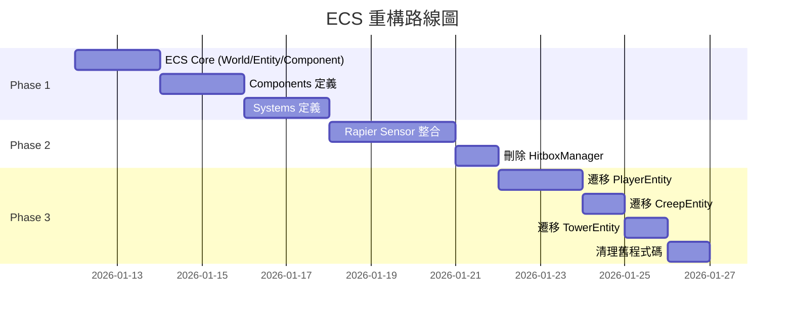

# WebDota ECS 與 Rapier Sensor 重構計畫

日期: 2026-01-11

## 目標

1. **ECS 架構**: 將現有 OOP 實體系統改為 Entity-Component-System
2. **Rapier Sensor**: 取代自製 HitboxManager，使用 Rapier 原生碰撞事件
3. **維持 P2P**: 網路架構不變

---

## Phase 1: ECS 核心架構

### 1.1 目錄結構

```
src/core/ecs/
├── World.ts           # ECS 世界管理
├── Entity.ts          # Entity = ID only
├── Component.ts       # Component 基底
├── System.ts          # System 基底
├── components/        # 所有 Components
│   ├── TransformComponent.ts
│   ├── HealthComponent.ts
│   ├── TeamComponent.ts
│   ├── CombatComponent.ts
│   ├── SkillComponent.ts
│   ├── RenderComponent.ts
│   └── PhysicsComponent.ts
└── systems/           # 所有 Systems
    ├── MovementSystem.ts
    ├── CombatSystem.ts
    ├── RenderSystem.ts
    └── HealthSystem.ts
```

### 1.2 核心類別

#### [NEW] Entity.ts

```typescript
// Entity 只是一個 ID
export type EntityId = string;

export function createEntity(): EntityId {
    return crypto.randomUUID();
}
```

#### [NEW] Component.ts

```typescript
export interface Component {
    readonly type: string;
}

// Component 存放在 Map<EntityId, Component>
```

#### [NEW] World.ts

```typescript
export class World {
    private entities: Set<EntityId> = new Set();
    private components: Map<string, Map<EntityId, Component>> = new Map();
    private systems: System[] = [];

    createEntity(): EntityId { ... }
    addComponent<T extends Component>(entityId: EntityId, component: T): void { ... }
    getComponent<T extends Component>(entityId: EntityId, type: string): T | undefined { ... }
    query(...componentTypes: string[]): EntityId[] { ... }
    update(dt: number): void { ... }
}
```

### 1.3 Components 定義

| Component | 欄位 | 用於 |
|-----------|------|------|
| `TransformComponent` | position, rotation | 所有實體 |
| `HealthComponent` | currentHp, maxHp, isDead | 可被攻擊的實體 |
| `TeamComponent` | team: 'red' \| 'blue' \| 'neutral' | 需判定敵我 |
| `CombatComponent` | attackPower, defense, attackRange | 可攻擊的實體 |
| `RenderComponent` | pcEntity: pc.Entity | 需要渲染的實體 |
| `PhysicsComponent` | rigidBody: RAPIER.RigidBody, collider | 有物理碰撞 |

---

## Phase 2: Rapier Sensor 整合

### 2.1 技能判定 Sensor

取代 `HitboxManager.createHitbox()`：

```typescript
export class SkillHitbox {
    static create(
        world: RAPIER.World,
        position: { x: number, y: number, z: number },
        radius: number,
        ownerId: EntityId,
        ownerTeam: Team
    ): RAPIER.Collider {
        const rigidBodyDesc = RAPIER.RigidBodyDesc.kinematicPositionBased()
            .setTranslation(position.x, position.y, position.z);
        const rigidBody = world.createRigidBody(rigidBodyDesc);

        const colliderDesc = RAPIER.ColliderDesc.ball(radius)
            .setSensor(true)
            .setActiveEvents(RAPIER.ActiveEvents.COLLISION_EVENTS)
            .setActiveCollisionTypes(
                RAPIER.ActiveCollisionTypes.DEFAULT |
                RAPIER.ActiveCollisionTypes.KINEMATIC_FIXED |
                RAPIER.ActiveCollisionTypes.KINEMATIC_KINEMATIC
            );

        const collider = world.createCollider(colliderDesc, rigidBody);
        
        // 儲存 metadata (用 userData 或外部 Map)
        colliderMetadata.set(collider.handle, { ownerId, ownerTeam, damage: 50 });
        
        return collider;
    }
}
```

### 2.2 碰撞事件處理

```typescript
// 在 GameEngine 或 CombatSystem 中
const eventQueue = new RAPIER.EventQueue(true);

update(dt: number) {
    this.physicsWorld.step(eventQueue);

    eventQueue.drainIntersectionEvents((handle1, handle2, started) => {
        if (started) {
            const meta1 = colliderMetadata.get(handle1);
            const meta2 = colliderMetadata.get(handle2);
            
            // 判斷是技能 hitbox 還是實體
            if (meta1?.isHitbox && meta2?.entityId) {
                this.handleHit(meta1, meta2);
            }
        }
    });
}
```

---

## Phase 3: 遷移現有實體

### 3.1 PlayerEntity → ECS

```diff
- const player = new PlayerEntity(id, characterId, team, app, physicsWorld, position, color);
+ const playerId = world.createEntity();
+ world.addComponent(playerId, new TransformComponent(position));
+ world.addComponent(playerId, new HealthComponent(1000));
+ world.addComponent(playerId, new TeamComponent(team));
+ world.addComponent(playerId, new CombatComponent({ attackPower: 50 }));
+ world.addComponent(playerId, new RenderComponent(createPlayerVisual(app, color)));
+ world.addComponent(playerId, new PhysicsComponent(createRigidBody(physicsWorld, position)));
```

### 3.2 CreepEntity → ECS

同上模式，只是參數不同。

### 3.3 TowerEntity → ECS

同上模式。

---

## Phase 4: 性能規訓與優化 (Performance Optimization) [COMPLETED]

### 4.1 空間分區 (Spatial Partitioning) - DONE
- **實作**: `SpatialSystem.ts` 使用 Spatial Hashing 優化 $O(N^2)$ 鄰近查詢。
- **應用**: 優化 `AISystem` 中的目標尋找與 `CollisionSystem` 的碰撞檢測預過濾。

### 4.2 材質快取 (Material Cache) - DONE
- **實作**: `MaterialCache.ts` 用於複用 `pc.StandardMaterial`。
- **目標**: 減少 WebGL 狀態切換與記憶體分配，杜絕頻繁生成小兵時的 GC 抖動。

### 4.3 物件池 (Object Pooling) - DONE
- **實作**: `EntityPool.ts` 與 `PoolableComponent.ts`。
- **應用**: 實作 `EntityFactory` 中的視覺實體池，複用 `pc.Entity` 以達成 60FPS 穩定運行。

---

## Phase 5: 網路協議規訓 (Network Protocol Evolution) [COMPLETED]

### 5.1 二進位序列化 (Binary Serialization) - DONE
- **目標**: 移除高頻 JSON 負載，改用緊湊的 `ArrayBuffer`。
- **實作**: `BinarySerializer.ts` 處理 `INPUT`, `SYNC_FRAME`, `GAME_STATE`。 [CORE COMPLETED]

### 5.2 流量負熵優化 (Bandwidth Optimization) - DONE
- **應用**: 在 P2P Mesh 架構下，透過將 `INPUT` 與 `GAME_STATE` 全量轉換為二進位序列化，單個封包大小理順至 14 Bytes，極大化了去中心化網路的通訊主權，延緩了 $N^2$ 連線帶來的性能衰減。 [FULLY INTEGRATED]

## Phase 6: 環境主權與 UI 規訓 (Environment Sovereignty & UI Hardening) [IN PROGRESS]

### 6.1 畫面視口修復 (Viewport Hardening) - FULLY HARDENED
- **問題**: 選角後 PlayCanvas 渲染視口與 Vue 畫布容器產生尺寸不對焦。
- **修復**: 在 `GameView.vue` 初始化後強制執行 `resizeCanvas()`，加入 Resize 監聽器，並於 GitHub Actions 中硬化推送權限以確保穩定上線。

### 6.2 邊緣主權預演 (Edge Sovereign Preparation) - DONE
- **目標**: 對焦 NVIDIA GTC 2026 定調的「物理 AI」與 Vera CPU 趨勢。
- **實作**: 在 `GameService.ts` 引入 `preflightCheck` 協議，為未來邊緣加速邏輯鋪路。

### 6.3 戰局自癒與持久化 (State Persistence & Resilience) - DONE
- **背景**: 參考 Curiosity Engine v26.0319 研究報告中提到的「LangGraph Checkpointing」。
- **實作**: 在 `GameEngine.ts` 實作 `saveCheckpoint()`，將 P2P 戰局狀態持久化至 本地 `localStorage`（因果地板），大幅降低斷線後的狀態遺失。

### 6.4 共識主權與裁判規訓 (Consensus Sovereignty & Referee Hardening) - DONE
- **背景**: 對焦 P2P Mesh 架構下的狀態衝突判定。
- **實作**: 建立 `RefereeManager.ts`，對每一幀關鍵數據進行「指紋化 (Hashing)」。在 `handleGameState` 中執行跨節點校驗，一旦偵測到「因果分歧 (Causal Divergence)」即發出 警告，為未來引入「裁判代理」自動修復鋪路。


## 檔案變更總覽

| 操作 | 路徑 | 說明 |
|------|------|------|
| [NEW] | `src/core/ecs/World.ts` | ECS 世界管理 |
| [NEW] | `src/core/ecs/Entity.ts` | Entity ID 工具 |
| [NEW] | `src/core/ecs/Component.ts` | Component 基底 |
| [NEW] | `src/core/ecs/System.ts` | System 基底 |
| [NEW] | `src/core/ecs/components/*.ts` | 所有 Components |
| [NEW] | `src/core/ecs/systems/*.ts` | 所有 Systems |
| [MODIFY] | `src/core/GameEngine.ts` | 整合 ECS World |
| [DELETE] | `src/core/combat/HitboxManager.ts` | 由 Rapier Sensor 取代 |
| [DEPRECATE] | `src/core/PlayerEntity.ts` | 遷移完成後刪除 |
| [DEPRECATE] | `src/core/entities/*.ts` | 遷移完成後刪除 |

---

## 風險與緩解

| 風險 | 影響 | 緩解措施 |
|-----|------|---------|
| 大規模重寫 | 可能引入新 bug | 分階段：先建 ECS，再遷移 |
| 學習曲線 | 開發變慢 | 文件化 ECS 使用範例 |
| 遺漏 edge case | 功能回歸 | 遷移時對比原始碼 |

---

## 執行順序



**預估總工時**: 2-3 週
